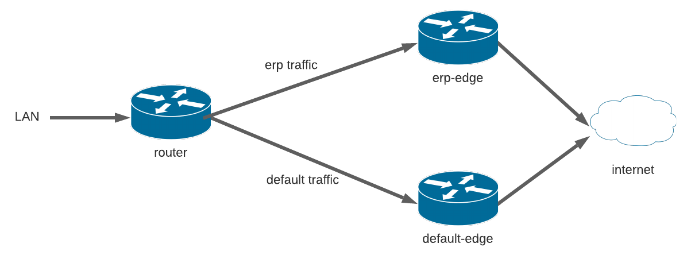

# Double Edge Network

#### Network with two edges and a router to distribute traffic between them.

When both edges are available, router distributes erp traffic over ERP-EDGE and other traffics over DEFAULT-EDGE. When one is unavailable, router redirects all traffic to another, ensuring high availability.

